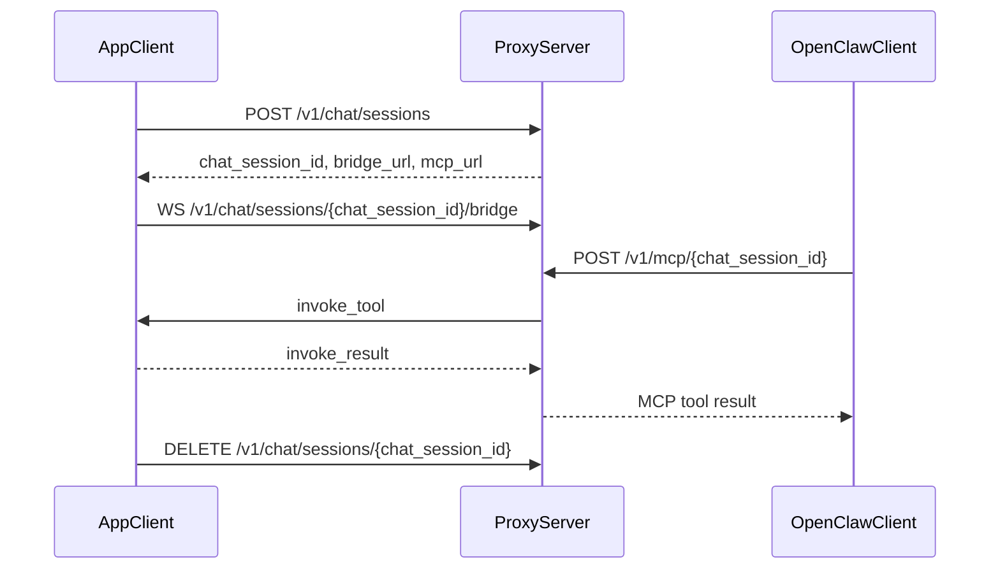

# OpenClaw MCP Proxy

OpenClaw MCP Proxy is a small FastAPI + FastMCP service that exposes app-registered tools as an MCP server for OpenClaw, while forwarding actual tool execution back to the app over a WebSocket bridge.

It has two responsibilities:

- Manage chat-scoped proxy sessions over HTTP and WebSocket.
- Expose the registered tool set as MCP over either stateless HTTP or stdio.

## Architecture



## Endpoints

### `POST /v1/chat/sessions`

Creates a chat session and returns the bridge and MCP endpoints for that session.

Request body:

```json
{
  "user_id": "user-1",
  "device_id": "device-1",
  "device_name": "desktop",
  "app_version": "1.0.0",
  "chat_id": "chat-1",
  "tools": [
    {
      "name": "echo_text",
      "path": "/tools/echo_text",
      "description": "Echo text.",
      "input_schema": {
        "type": "object",
        "properties": {
          "text": {
            "type": "string"
          }
        }
      }
    }
  ]
}
```

Response body:

```json
{
  "chat_session_id": "session-id",
  "bridge_url": "ws://127.0.0.1:8000/v1/chat/sessions/session-id/bridge",
  "mcp_url": "http://127.0.0.1:8000/v1/mcp/session-id"
}
```

### `DELETE /v1/chat/sessions/{chat_session_id}`

Deletes a chat session.

Response body:

```json
{
  "ok": true
}
```

### `WS /v1/chat/sessions/{chat_session_id}/bridge`

Connects the app-side execution bridge for a registered chat session.

Bridge messages:

- Proxy -> app: `invoke_tool`
- App -> proxy: `invoke_result`
- Proxy -> app: `ping`
- App -> proxy: `pong`

Proxy -> app:

```json
{
  "type": "invoke_tool",
  "chat_session_id": "session-id",
  "request_id": "session-id:1",
  "tool_name": "echo_text",
  "arguments": {
    "text": "hello"
  }
}
```

App -> proxy:

```json
{
  "type": "invoke_result",
  "chat_session_id": "session-id",
  "request_id": "session-id:1",
  "ok": true,
  "content": {
    "echoed_text": "hello"
  }
}
```

### `POST /v1/mcp/{chat_session_id}`

Exposes the registered tools for a specific chat session as a stateless HTTP MCP endpoint.

This is the simplest way to connect OpenClaw to a specific registered session.

### `POST /v1/mcp/` with `X-OpenClaw-Chat-Session`

The MCP endpoint also supports header-based session routing:

- Header: `X-OpenClaw-Chat-Session: <chat_session_id>`

This is useful when the MCP client configuration prefers a stable URL and injects the session ID through headers.

## MCP Transports

The proxy now supports two MCP-facing transports:

- HTTP: multi-session, routed by path or `X-OpenClaw-Chat-Session`
- stdio: single-session, bound at process startup via `--chat-session-id`

The stdio transport is implemented as a local proxy process in front of the HTTP MCP endpoint. The
actual tool execution path is unchanged:

1. The app registers a chat session over HTTP.
2. The app connects the WebSocket bridge.
3. The stdio process proxies MCP traffic to `POST /v1/mcp/{chat_session_id}`.
4. The HTTP proxy forwards tool execution to the app over the existing bridge.

### `GET /health`

Returns plain text `ok`.

## Authentication

The proxy uses two independent bearer tokens:

- `OPENCLAW_PROXY_APP_TOKEN`
  Used by:
  - `POST /v1/chat/sessions`
  - `DELETE /v1/chat/sessions/{chat_session_id}`
  - `WS /v1/chat/sessions/{chat_session_id}/bridge`

- `OPENCLAW_PROXY_OPENCLAW_TOKEN`
  Used by:
  - `/v1/mcp/...`

Important:

- If `OPENCLAW_PROXY_APP_TOKEN` is empty, app-facing endpoints accept requests without authentication.
- If `OPENCLAW_PROXY_OPENCLAW_TOKEN` is empty, MCP-facing endpoints accept requests without authentication.

Do not leave either token empty outside local development.

WebSocket close codes:

- `4401`: invalid app token
- `4404`: unknown `chat_session_id`

## Configuration

Environment variables:

| Variable | Default | Description |
| --- | --- | --- |
| `OPENCLAW_PROXY_APP_TOKEN` | `""` | Bearer token for app registration and bridge endpoints. |
| `OPENCLAW_PROXY_OPENCLAW_TOKEN` | `""` | Bearer token for MCP requests from OpenClaw. |
| `OPENCLAW_PROXY_SERVER_URL` | `http://127.0.0.1:8000` | Base URL used by the stdio proxy process to reach the HTTP proxy. |
| `OPENCLAW_PROXY_SESSION_TTL_SECONDS` | `300` | Session time-to-live in seconds. |
| `OPENCLAW_PROXY_TOOL_TIMEOUT_SECONDS` | `120` | Tool call timeout in seconds. |

Example `.env`:

```env
OPENCLAW_PROXY_APP_TOKEN=replace-me
OPENCLAW_PROXY_OPENCLAW_TOKEN=replace-me
OPENCLAW_PROXY_SERVER_URL=http://127.0.0.1:8000
OPENCLAW_PROXY_SESSION_TTL_SECONDS=300
OPENCLAW_PROXY_TOOL_TIMEOUT_SECONDS=120
```

## Run Locally

### Requirements

- Python 3.11+ recommended
- `pip`

### Install dependencies

```bash
pip install fastapi fastmcp pydantic uvicorn
```

### Start the server

```bash
uvicorn app.main:app --host 0.0.0.0 --port 8000
```

### Start the stdio MCP proxy

After creating a chat session and connecting the app bridge, you can expose that session over stdio:

```bash
python -m app.stdio_main --chat-session-id <chat_session_id>
```

Optional flags:

```bash
python -m app.stdio_main \
  --chat-session-id <chat_session_id> \
  --proxy-base-url http://127.0.0.1:8000
```

### Check health

```bash
curl http://127.0.0.1:8000/health
```

Expected output:

```text
ok
```

## OpenClaw MCP Configuration

Header-routed example:

```json
{
  "mcpServers": {
    "otakuroom-chat-mcp": {
      "transport": "http",
      "url": "https://your-proxy-host.example.com/v1/mcp",
      "headers": {
        "Authorization": "Bearer ${OPENCLAW_PROXY_OPENCLAW_TOKEN}",
        "X-OpenClaw-Chat-Session": "${CHAT_SESSION_ID}"
      }
    }
  }
}
```

You can also connect directly to the session-specific URL returned by session creation, for example:

```text
https://your-proxy-host.example.com/v1/mcp/<chat_session_id>
```

Stdio example:

```json
{
  "mcpServers": {
    "otakuroom-chat-mcp": {
      "transport": "stdio",
      "command": "python",
      "args": [
        "-m",
        "app.stdio_main",
        "--chat-session-id",
        "${CHAT_SESSION_ID}"
      ],
      "env": {
        "OPENCLAW_PROXY_SERVER_URL": "http://127.0.0.1:8000",
        "OPENCLAW_PROXY_OPENCLAW_TOKEN": "${OPENCLAW_PROXY_OPENCLAW_TOKEN}"
      }
    }
  }
}
```

## How Tool Forwarding Works

1. The app creates a chat session and sends its available tool definitions.
2. The proxy stores the session in memory.
3. OpenClaw calls the session MCP endpoint.
4. The proxy dynamically builds a FastMCP server for that session and tool set.
5. When OpenClaw invokes a tool, the proxy sends `invoke_tool` over the WebSocket bridge.
6. The app executes the tool locally and sends `invoke_result`.
7. The proxy returns the tool result to the MCP caller.

## Testing

Run the proxy integration tests:

```bash
python -m unittest tests.test_proxy_integration
```

Current coverage includes:

- session-specific MCP routing via `mcp_url`
- header-based MCP routing via `X-OpenClaw-Chat-Session`
- normal WebSocket bridge disconnect without error-level logging
- shared MCP server construction and stdio proxy bootstrap behavior

## Operational Notes

- Sessions are stored in memory only.
  The proxy is not currently designed for stateless multi-instance deployment without sticky routing or shared session state.

- Tool calls require an active bridge connection.
  If the session exists but the bridge is disconnected, tool calls fail with `Chat bridge is not connected.`

- Sessions expire automatically.
  A background cleanup loop runs every 15 seconds and removes expired sessions.

- Registered tool names must be unique within a chat session.

- Reverse proxies must support WebSocket upgrade and must forward:
  - `Authorization`
  - `X-OpenClaw-Chat-Session`

- HTTP MCP is served directly from the in-process session registry.
- stdio MCP runs as a separate proxy process and forwards to the HTTP MCP endpoint.
- Tool schemas are registered dynamically from the provided `input_schema`.
  Only trusted app clients should be allowed to register tool definitions.

## Limitations

- No persistent session storage.
- No built-in rate limiting.
- No container or deployment manifests are included in this directory.
- Audit logging is plain application logging, not a full security audit pipeline.
